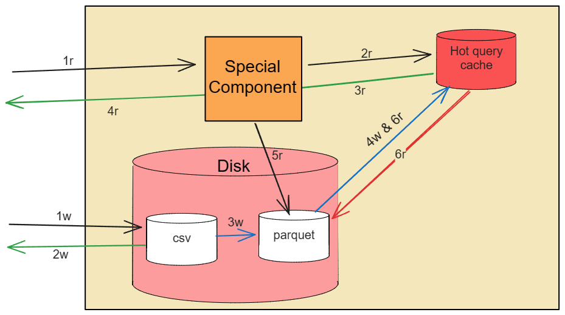

# SimpleLogAndQuery

SimpleLogAndQuery is a basic server designed to process specific types of CSV files and write them to disk. It's optimized for high throughput and bulk queries.

## How to Run

To run this project, follow these steps:

1. Install the required packages by running the following command:

    ```bash
    pip install -r requirements.txt
    ```

2. Start the server by running the main script:

    ```bash
    python main.py
    ```

3. Open another terminal and navigate to the project directory.

4. You can use the following APIs to interact with the server:

    a. **Count Logs API:**
       - This API provides a count of logs for a specific component. You can use it with a `GET` request.

       ```bash
       curl -X GET http://localhost:5000/count_logs?Component=spark.SecurityManager
       ```

       Example:
       - To count logs with a specific EventId, use:

       ```bash
       curl -X GET http://localhost:5000/count_logs?EventId=E11
       ```

       - To count logs with a specific log level (e.g., INFO), use:

       ```bash
       curl -X GET http://localhost:5000/count_logs?Level=INFO
       ```

       - To count logs with multiple parameters (Component, EventId, and Level), use:

       ```bash
       curl -X GET "http://localhost:5000/count_logs?Component=executor.Executor&EventId=E24&Level=INFO"
       ```

    b. **Write Logs API:**
       - This API allows you to upload a CSV file for writing logs. It accepts the file as binary data with the appropriate content type and uses a `POST` request.

       ```bash
       curl --data-binary "@example_csv_data/Spark_2k.log_structured_1.csv" -H "Content-Type: text/csv" -X POST http://localhost:5000/write_logs
       ```

## High-level Server Architecture



The architecture diagram above provides an overview of the server's components and their interactions. Here 'r' represents read and 'w' represents writes.

## Tools Used

The following tools were used in the development of this project:

1. Flask
   - Flask is a micro web framework for building web applications in Python.

2. azureml-dataprep
   - azureml-dataprep is a Python package for data preparation and feature engineering.

3. Apache Parquet
   - Apache Parquet is a columnar storage file format that is highly optimized for analytics and big data processing.

4. Pandas
   - Pandas is a powerful data manipulation and analysis library for Python.

Feel free to explore and adapt this project for your needs. If you have any questions or encounter issues, refer to the project documentation or reach out to the maintainers for assistance.